In this tutorial, I will guide you step by step into creating a functionnal robot arm, that uses any number of servomotors, and that can be controlled using Arduino board.
In this tutorial, I'll be using Braccio robot arm, but you can adapt the code to whatever hardware you have using Arduino's builtin Servo library.

- [Step 1: Creating a robot arm in blender](#step-1-creating-a-robot-arm-in-blender)
  - [a) Create the armature](#a-create-the-armature)
  - [b) Add an IK goal to the armature](#b-add-an-ik-goal-to-the-armature)
- [Step 1bis: Naming your bones !](#step-1bis-naming-your-bones-)
- [Step 2: Setting up the IK constraint](#step-2-setting-up-the-ik-constraint)
  - [a) Set IK goal constraint](#a-set-ik-goal-constraint)
  - [b) Define rotation limits for each joint](#b-define-rotation-limits-for-each-joint)
      - [<u>Define limits for the base bone</u>](#udefine-limits-for-the-base-boneu)
      - [<u>Define limits for the other bones</u>](#udefine-limits-for-the-other-bonesu)
- [Step 3: Animating your virtual robot](#step-3-animating-your-virtual-robot)
  - [a) Make the IK Goal follow an Empty object](#a-make-the-ik-goal-follow-an-empty-object)
      - [<u> Configure the rotation mode of the bones</u>](#u-configure-the-rotation-mode-of-the-bonesu)
  - [b) Make the Empty object follow a path](#b-make-the-empty-object-follow-a-path)
      - [<u> Create the path </u>](#u-create-the-path-u)
      - [<u> Add Follow Path constraint </u>](#u-add-follow-path-constraint-u)
  - [c) Bake the animation into a new action](#c-bake-the-animation-into-a-new-action)
- [Step 4: Make the robot move according to your animations](#step-4-make-the-robot-move-according-to-your-animations)
  - [a) Exporting animation from blender to CSV](#a-exporting-animation-from-blender-to-csv)
  - [b) Using control.py to send animation to the robot](#b-using-controlpy-to-send-animation-to-the-robot)

# Step 1: Creating a robot arm in blender

If you have Braccio robot and don't want to bother with creating your own robot arm in blender, you can skip this step, download the blend file [here]() and go to step

## a) Create the armature
First, open up blender, select everything (<kbd>A</kbd>)

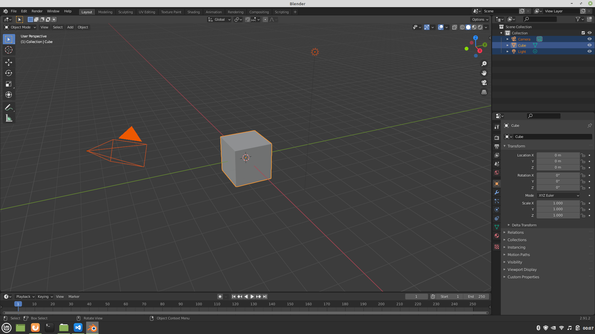

and delete (<kbd>X</kbd> and left click to confirm), so you start with a clean environment.

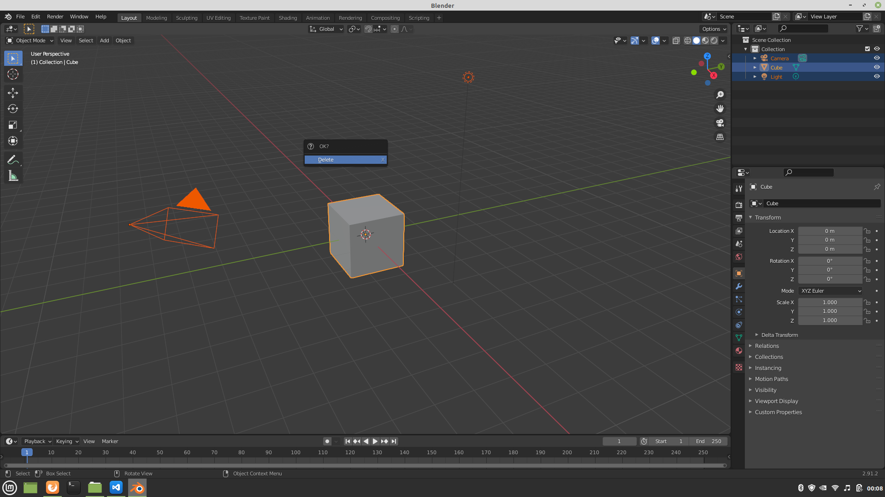

Next, go to front view (Numpad 1 or 3D viewport > View > Front) and add an armature (Shift+A > Armature)

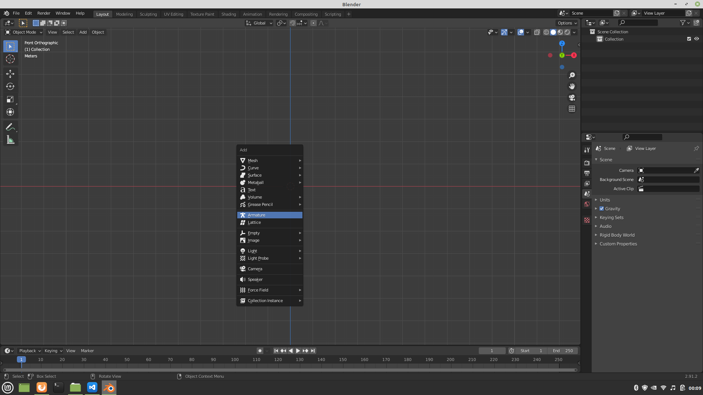

With the newly created armature selected (left click on it if it's not outlined in the viewport), go to edit mode (Tab).

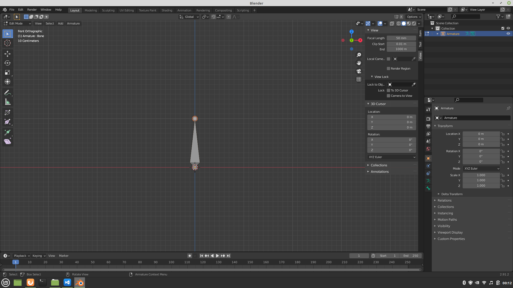

Here comes the part where you will set the 3D coordinates of the joints according to the arm you would like to control. Here, we will focus on how to setup the Braccio's robot arm, but this can be applied to any chain of joints.

> 🗒 In our example, without getting into too much details, we will set the rest pose of our robot (*i.e.* 0° angle for each bone) to be with all joints vertical and aligned. But keep in mind that from the robot's point of view, this posture actually corresponds to every servo set to a 90° angle. We will take this into account when exporting the poses to CSV.

Before we start modeling the robot, here is a brief overview of what you need to know about bones in blender (and any other 3D software).

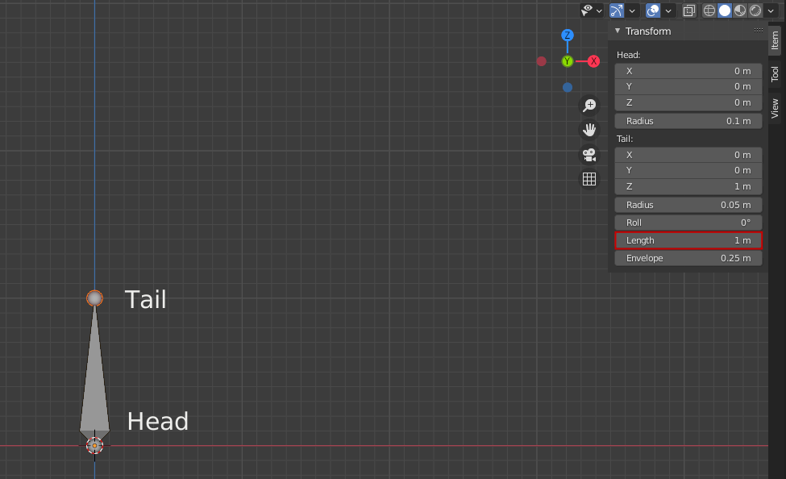

> ℹ️ When defining the armature, be sure to be in edit mode (blender tells you the mode you're in on the top left corner, with a drop down menu).

First things first, this bone is too big (1 meter) compared to the physical arm that we have. Most of the time, this won't be a problem as long as you get the proportions right. But what would happen if you wanted to model the whole environment of the arm, with animated physics, etc ?

Better safe than sorry, let's model it to scale! It's pretty straightforward and can save you a lot of time in the future.

To set the size of the bone, type in the length (in any metric units) you want it to be in the box I highlighted in red (see above image). In the case of the first bone of Braccio's robot arm, this will be '75 mm'.

After that, you might see that the bone shrunk inside the 3D viewport. This is normal, to see it again fit in the screen just press period (<kbd>.</kbd>)key. This is what you should have so far:

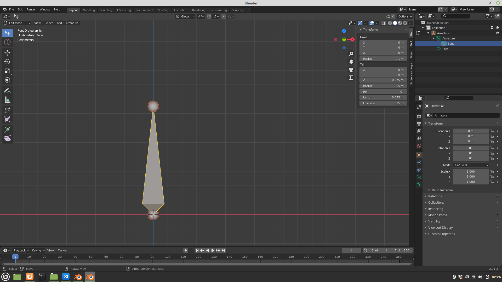

Now let's add a bone to the chain. Select (left click) the tail of the first bone, and press <kbd>E</kbd> to start adding a bone as a child. If you move your mouse, you will see that you can move it freely. But we want every bone to be aligned with its parent. So press <kbd>Z</kbd>, once, to constraint the movement on the Z-axis. Drag the mouse around, then click when you like the position of the newly created bone. This determines the length of the bone, but you can always change it like you did in the previous step.

Finally, let's repeat these last two steps of <kbd>E</kbd> (creating new child) and setting the correct length (select bone, go to the right panel, change length).

Here are the lengths of the four links that we will use in this tutorial:
[75 mm, 125 mm, 125 mm, 60 mm].

So after repeating these steps, this is how it should look like now :

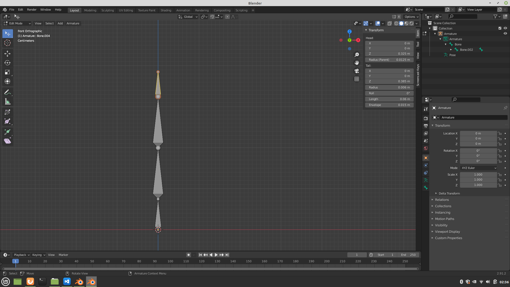

## b) Add an IK goal to the armature
The most intuitive way to think of armature, rigging, and animating, is to see the skeleton as a chain of joints, where the end tip of the last link will have its position determined by each rotation of the joints in the chain. This is referred to as Forward Kinematics (FK). But what if you wanted the last bone to land at a specific location in space? This is where Inverse Kinematics (IK) comes in handy. Since these are very advanced maths, we won't explain how it works (actually I don't know either). But fortunately, Blender does it for us! At this step, all you need to do is, while you're still in edit mode, is to create one last bone at the end of the chain, like so (<kbd>E</kbd>, then <kbd>X</kbd>):

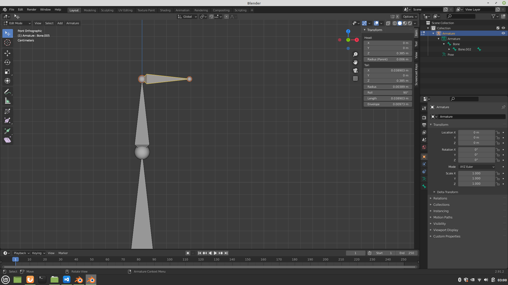

The length of this bone doesn't matter at all, just keep it at an OK size so that you can see it, but not select it by accident.

With this bone (still) selected, separate it from the chain by pressing 'Alt + P' and choose 'Clear Parent':

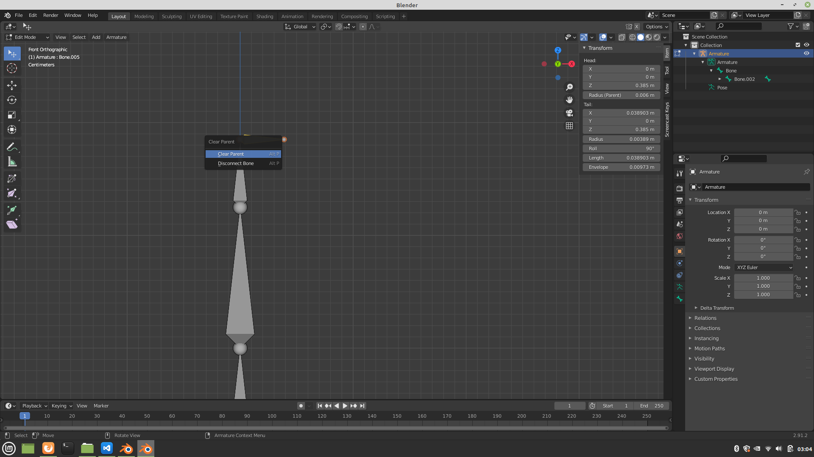

This last bone, that you just cleared the parent of, will be the IK goal, *i.e* a bone that will not be part of the chain but instead will guide the bones towards the goal.

Now, last step we need in order to avoid any trouble, just press 'Alt + R' to clear the roll.

> 🗒 Before going to step 2, make sure that the orientation of the bones is the same as the one showed in this tutorial. That is, all bones aligned on the Z-axis. Of course, if your rig is different just ignore this remark.

# Step 1bis: Naming your bones !
This step will come in handy when you want to export the animation as a CSV. To rename bones, in edit mode, just press 'F2' and change name. In this tutorial, the bones are named [Base, Shoulder, Elbow, Wrist vertical].
If you name them differently, it doesn't really matter, you will just need to replace the names in the python code that's provided with this tutorial.

For the IK bone, the last one you've created, you can name it as you want, it doesn't matter.

# Step 2: Setting up the IK constraint
## a) Set IK goal constraint
Go to pose mode (top left corner, choose 'Pose Mode'). Select (left click) the last bone of the chain (it should be highlighted in blue). Then on the right panel (Properties), add bone constraint (please refer to the image below):

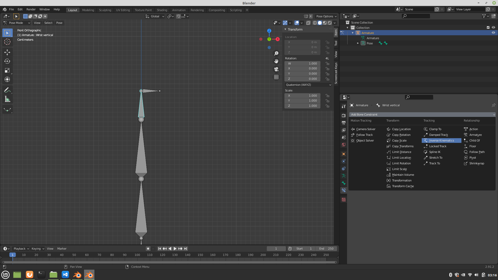

Then, to configure the IK constraint, choose Armature object as the target and IK Goal as the Bone. Chain length controls the total number of links in the chain, zero meaning every link in the chain will be considered up to the root.

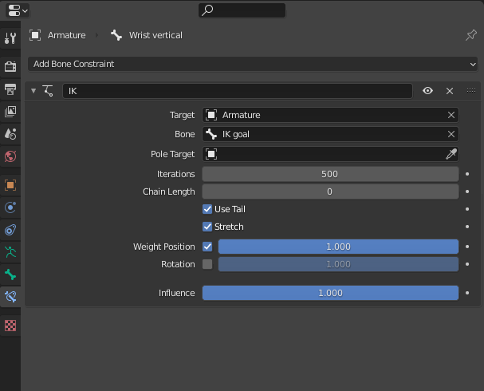

## b) Define rotation limits for each joint
In order to help you visualize the rotations of the bones, it is advised that you check 'Axes' in the properties panel for the armature. Like so:

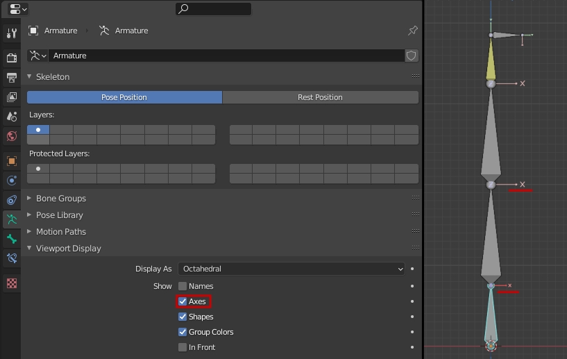

> You may have noticed, the Y-axis of the bone is always in the direction the bone is pointing to. And in our case, I chose the Z-axis of the bone to be the pivot.

If you followed the previous steps correctly, you should have a bone (IK Goal) that controls the tip of your chain. However, you might see that, while moving the IK Goal, the bones can rotate in every direction.

This doesn't look like the actual rotation ranges of the servos. First, your servos are limited to a 180° span (unless you use stepper motors). Second, because each servo only has one degree of freedom.

To reflect this in your Blender's model of the robot, you need to set rotation limits. Select (left-clik) the Base bone (still in Pose Mode), and click to open the Inverse Kinematics dropdown menu on the Properties panel.

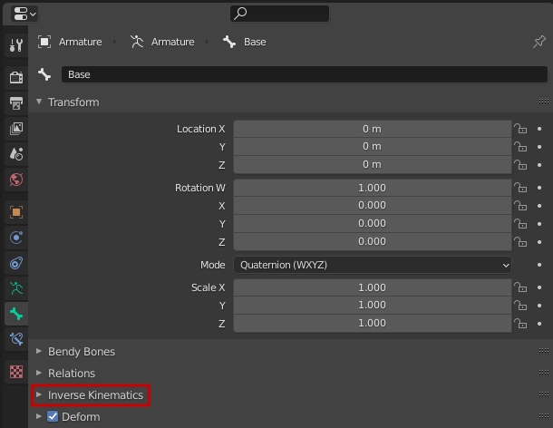

You will find the properties panel like the one shown below, you need to check :
* the axes you want to lock the rotation on
* set the rotation span for the remaining degree of freedom.

#### <u>Define limits for the base bone</u>
Let's start with the first bone (Base). This one moves on its own axis, that is, in Blender, its Y-axis. So for **this** bone, we will lock X and Z axes:

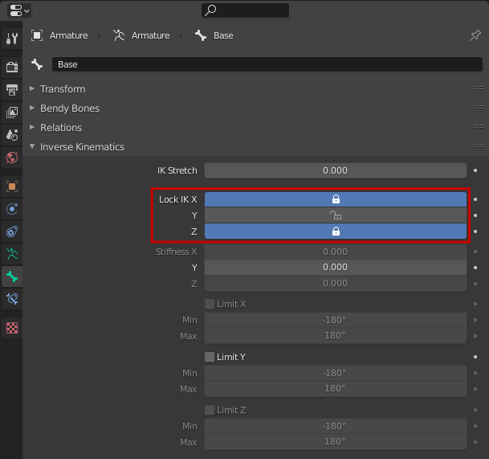

This way, the robot's base will only rotate around itself. So now, if you move the IK Goal bone, you should see the difference :

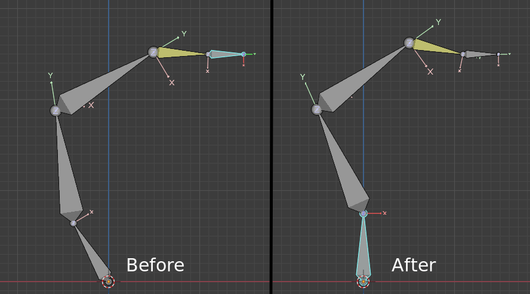

For this bone, we don't need to limit its rotation, for some annoying trigonometry reason this won't work.

The next bones will all have the same constraints, *i.e.* they will all rotate on their Z-axis, from -90° to +90° (remember, this is for Braccio robot, you may need to change it to suit your needs).

#### <u>Define limits for the other bones</u>
To constraint the other bones, check *Lock IK* on X and Y, making sure to check 'Limit Z' and set the Min, Max to -90°,90° respectively. See below for reference :

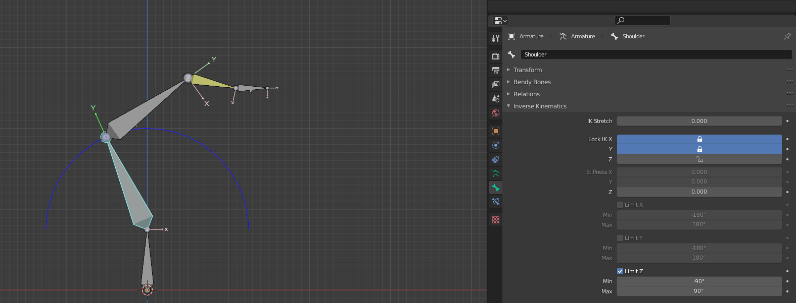

This will make sure that the joint will only follow the max range of any commercial servomotor that goes from 0 to 180°. 

Blender goes even fancier by visually displaying the rotation limits of every selected bone (blue lines for the Z-axis).

Repeat the exact same [step](#udefine-limits-for-the-other-bonesu) for the last two bones

Now you should see this result when you select all the bones in Pose Mode (<kbd>A</kbd> key).

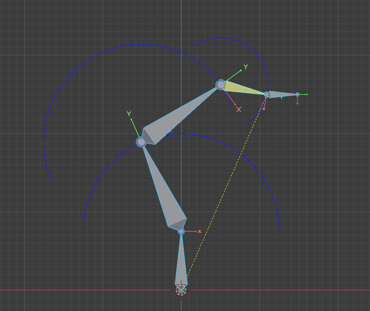

If you made it all the way to this, congratulations! 
> 🦾 Blender now knows how your robot looks like, and will rotate the joints in the same way your robot would. And not only that, it now computes in real time the joint rotations to make the last link of the chain reach the IK Goal.

And if you don't have this result, you can still download the blender file that was created for this tutorial at [this link](../Tutorial/robotArmTutorial.blend)

# Step 3: Animating your virtual robot

If you're reading this section, this means you have a perfect virtual replica of your robot arm inside Blender, ready to give it some motion and make it come to life :)

## a) Make the IK Goal follow an Empty object

From the previous steps, you might still be in Pose Mode. Go to object mode, add an empty ('Shift + A > Empty). You can choose whatever shape you like, I chose Plain Axes for mine but it is really up to you.

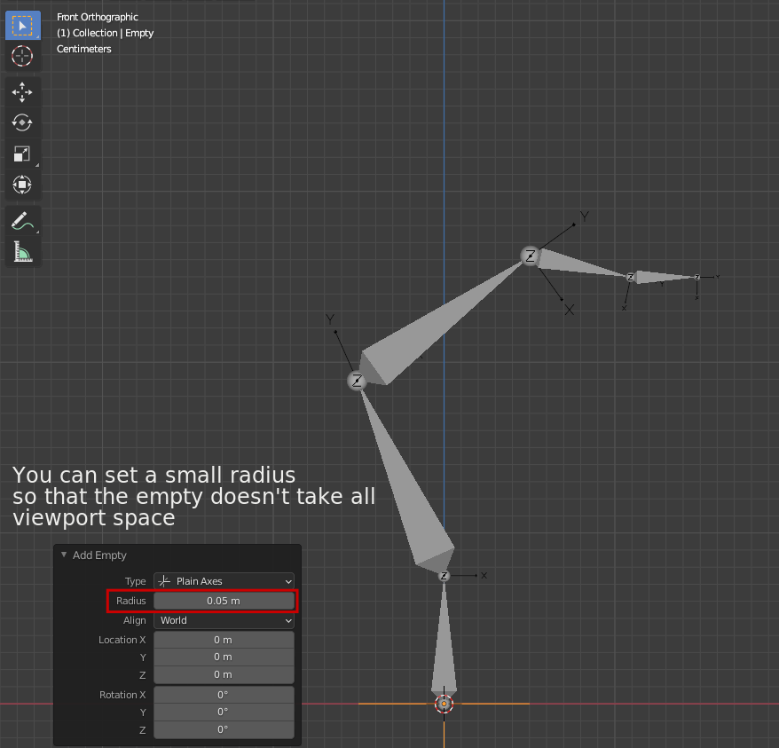

Now, to make the IK Goal follow the empty, select the armature, switch to Pose Mode, and select the IK Goal bone. Then add a 'Copy Location' **bone constraint** to it.

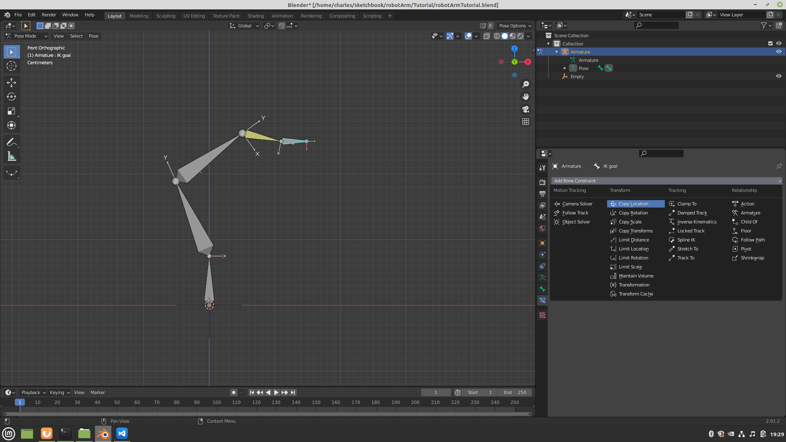

Select the game object you want to use to guide the IK Goal bone (mine is still called 'Empty'). If you didn't move your empty, it should still be at the 3D cursor location and you may end up with this :

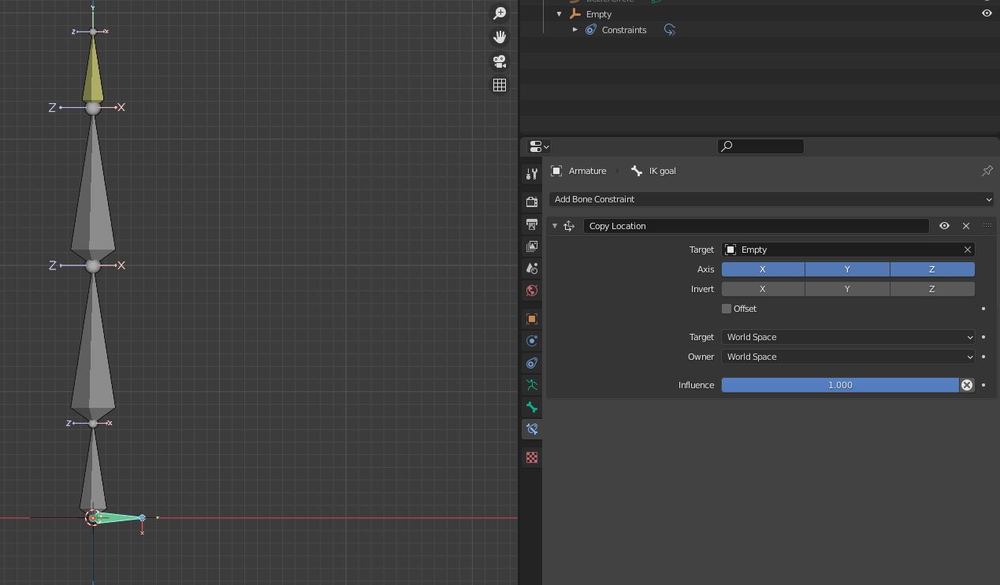

As you can see, Blender doesn't know how to make the tip of your arm go all the way down, so it makes it go all the way up (makes sense).

To fix this, go back to Object Mode, select the empty, and move it (<kbd>G</kbd>) somewhere the robot can reach. You should see the arm move to your empty.

#### <u> Configure the rotation mode of the bones</u>

You may think your rig is complete, right? Wrong! There is one last tweak to make so that the rotations will be animated correctly.
If you take a look at bone rotation modes now, you should see that they are in Quaternion mode. Quaternions are a complex representation for a rotation, that help avoiding so-called [gimbal lock](../Wiki/GimbalLock.md). In our case, it will be far more easier to use Euler angles, so this is what I advise to use.

So, if you go into Pose Mode, and select a bone, you should see this in the bone properties panel:

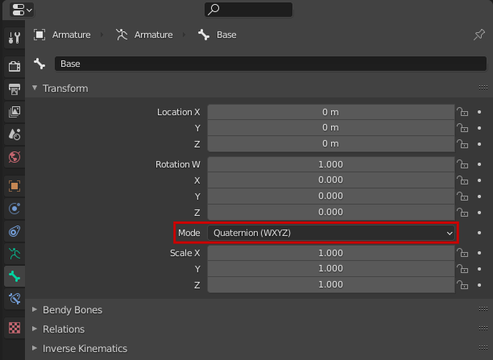

The idea is to switch to another rotation mode, setting the rotation axes order to the one used most of the time for the bone. For instance, the Base bone that we just selected here will only rotate around its Y-axis. So choose any rotation order that starts with Y. The same applies for every bone in the armature. So this is what you should end up with :

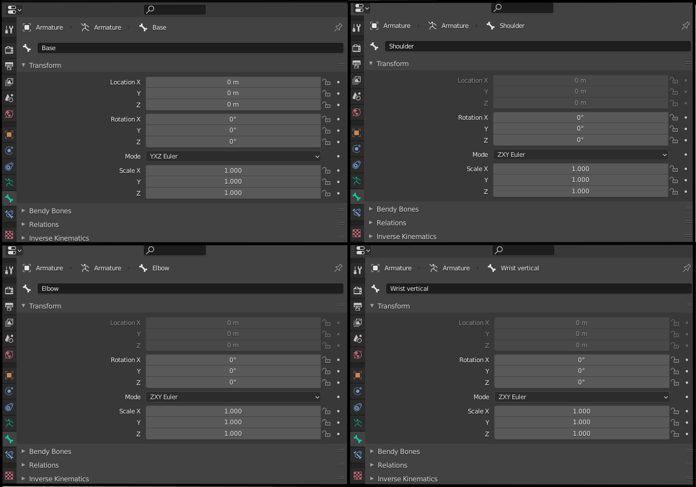

Now, all four bones have the same rotation mode, allowing the export script to read the euler angles of each joint of interest.

> 🦾 Now that this step is complete, you can simply animate the empty game object (which acts as a guide for the whole rig) and go to [step 4](#step-4-make-the-robot-move-according-to-your-animations) if you already know how to animate things in blender. Otherwise, if you don't know how to animate but don't want to follow a specific path like I'm about to show you, you can checkout [this](../Wiki/BlenderAnimateAnything.md) blender animation tutorial on how to animate any object in Blender.

## b) Make the Empty object follow a path

First, go back to object mode.Now you should see an empty object hanging around but perfectly still, you may want to animate it. Remember, wherever this empty goes, the IK Goal bone of the armature tries its best to reach it.

So in order to make the empty object follow the path, you need to :
1. Create a path
2. Add a Follow Path constraint

#### <u> Create the path </u>

> For the sake of this tutorial, we will create a very simple shape. Let's go for the letter D. Yep, that's right, I would be curious to read about your theories on why I chose this shape.

Seriously, back to the tutorial. First, if it was not the case already, go to Object Mode. Deselect everything (left clicking empty space), and add a circle (<kbd>Shift</kbd> + <kbd>A</kbd> > Add Mesh > Circle )

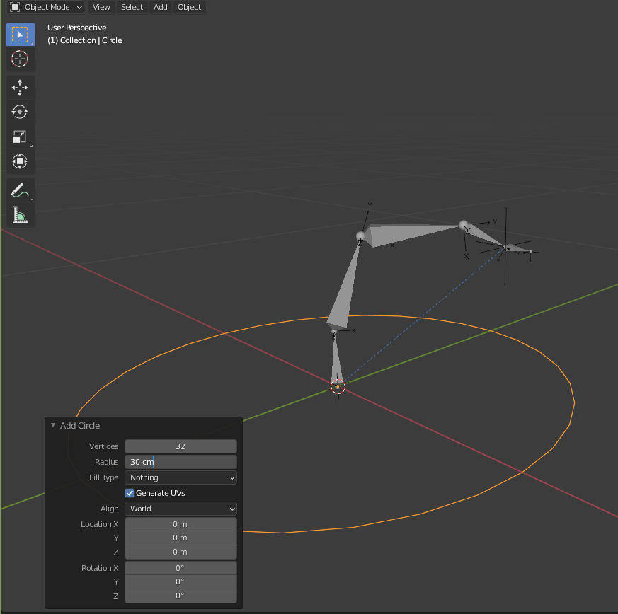

Notice that you can type in the radius directly, so that the circle fits in your scene.

With this step complete, you have yourself the letter 'O'. If you're happy with that, you can skip to the [next step](#u-add-follow-path-constraint-u). Otherwise, let me show you how to turn an 'O' into a 'D' in Blender.

So with the circle selected in Object Mode, go to Edit Mode (<kbd>Tab</kbd>), and remove half the vertices, like in the small gif below.

> Tip: to rotate an object around one axis, press <kbd>R</kbd> and then the axis of rotation (whether <kbd>X</kbd>, <kbd>Y</kbd>, or <kbd>Z</kbd>)

> You can also move an object with <kbd>G</kbd>, and chose the axis you want to move it on using <kbd>X</kbd>, <kbd>Y</kbd>, and <kbd>Z</kbd>

#### <u> Add Follow Path constraint </u>

Now, you want 

## c) Bake the animation into a new action

# Step 4: Make the robot move according to your animations

## a) Exporting animation from blender to CSV

## b) Using control.py to send animation to the robot